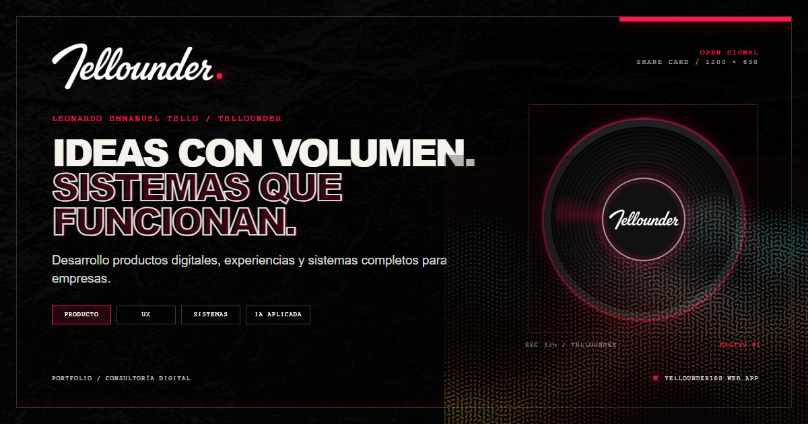
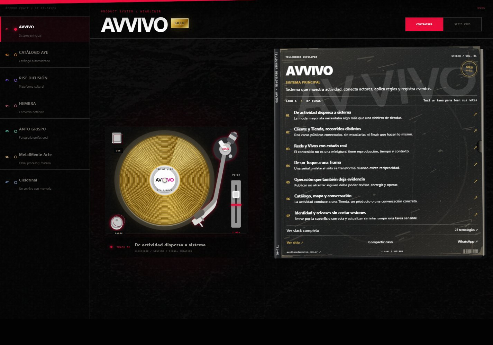

<div align="center">

<a href="https://tellounder108.web.app"></a>

# Tellounder · Developer

### Cada vinilo, una experiencia desarrollada.

Construí un tocadiscos para mostrar mi trabajo.
Cada disco es un proyecto. Lo elegís, lo tocás y leés qué hay detrás.

[Explorar el sitio](https://tellounder108.web.app) · [Experiencias](https://tellounder108.web.app/proyectos/avvivo) · [GitHub](https://github.com/Tellounder)

</div>

## Por qué un tocadiscos

Vengo de la electrónica y el sonido. Cuando empecé a darle forma a este portfolio,
quise que esa parte mía también estuviera presente. De ahí salió el tocadiscos:
un lugar donde cada trabajo tiene su propio vinilo, su etiqueta y su tapa.

En la contratapa escribí los temas de cada proyecto. No son canciones: son las
cosas que hubo que resolver. Al abrir un tema cuento la necesidad, la decisión
que tomé y cómo quedó implementada. Las tecnologías aparecen ahí, junto a lo que
hacen, para que no queden como una lista de logos sueltos.

Podés mirar el trabajo por arriba o meterte en sus detalles. Y desde la misma
tapa, abrir el sitio y recorrerlo por tu cuenta.

## El disco se puede tocar

El tocadiscos está construido con SVG, CSS y controles en React. El vinilo gira
sobre su eje, tiene brazo, pausa y ajuste de velocidad. Al mover el disco con
el mouse o con el dedo, la imagen y el sonido responden al gesto.

Para el scratch armé un pequeño motor con Web Audio API. Genera una textura de
ruido, roce y pequeños chasquidos; mezcla una versión hacia adelante y otra al
revés según el sentido del movimiento. La velocidad del gesto cambia el tono,
los filtros y el volumen. Al soltar, el sonido se apaga suavemente.

Es un efecto sintetizado para acercarse a la sensación de tocar un vinilo, no
una grabación de un disco real. El audio es opcional: podés entrar en silencio
y leer todo igual.

También trabajé la funda: cartón gastado, bordes rozados y el logo del proyecto
como una impresión tenue. Los títulos son texto real, no una imagen. Cuando
abrís un tema, sus notas aparecen por encima, sin estirar la tapa.



## Cómo está organizada la colección

| En la colección | En el proyecto |
| --- | --- |
| Un vinilo | Una experiencia desarrollada |
| Su etiqueta | La identidad del trabajo |
| La contratapa | El contexto y la lista de temas |
| Cada tema | Una necesidad o función resuelta |
| Las notas | Necesidad → decisión → resultado |
| El stack | Las tecnologías y su función concreta |
| Sitio vivo | La experiencia publicada, fuera del relato |

## La colección

| Experiencia | Qué cuenta |
| --- | --- |
| [AVVIVO](https://tellounder108.web.app/proyectos/avvivo) | Un sistema que conecta actividad, actores, reglas y operación. |
| [Catálogo Aye](https://tellounder108.web.app/proyectos/catalogo-aye) | Un catálogo personalizado que convierte la exploración en un pedido por WhatsApp. |
| [Rise Difusión](https://tellounder108.web.app/proyectos/rise-difusion) | Una plataforma de identidad y difusión musical. |
| [HEMBRA](https://tellounder108.web.app/proyectos/hembra) | Identidad, catálogo y universos creativos en una experiencia de comercio. |
| [Anto Grispo](https://tellounder108.web.app/proyectos/anto-grispo) | Fotografía recuperada y organizada como un portfolio narrativo. |
| [MetalMente Arte](https://tellounder108.web.app/proyectos/metalmente-arte) | Obra, materia y proceso convertidos en catálogo interactivo. |
| [Cielofinal](https://tellounder108.web.app/proyectos/cielo-final) | Música e historia reunidas en un archivo digital con memoria. |

## Diseño e implementación

Los controles también se pueden recorrer con teclado. Las notas cierran con
Escape y devuelven el foco al tema que abriste. Si tenés activada la preferencia
de movimiento reducido, las transiciones se ajustan a ella.

**Este portfolio:** React, TypeScript, Vite, CSS, SVG, Web Audio API y Font Awesome.
Las rutas públicas, metadatos, sitemap y portadas sociales acompañan la experiencia.
Playwright verifica interacciones, navegación y tamaños de pantalla.

> El stack del portfolio y el stack de cada proyecto son cosas distintas.
> Las tecnologías de una obra se explican dentro de su propio caso.

## Ejecutar localmente

Con Node.js compatible con la versión de Vite declarada en `package.json`:

```sh
npm ci
npm run dev
```

```sh
npm run build       # Compilación y validación de páginas públicas
npm run preview     # Vista previa local de la compilación
npm run test:ui     # Pruebas de interfaz; requieren Google Chrome
```

Este repositorio contiene el **portfolio Tellounder**, no las bases de datos,
credenciales ni infraestructura privada de las aplicaciones presentadas.
No se necesitan credenciales de clientes para ejecutar el portfolio localmente.

La copia pública no incluye configuraciones de acceso, registros de trabajo ni
el historial privado de otros proyectos. Las URLs y los datos de contacto que
aparecen en ella son los que muestra el sitio público. No hay despliegues
automáticos configurados.

## Autoría

Idea, diseño y desarrollo: **Leonardo Emmanuel Tello · Tellounder**.

Las marcas, fotografías y obras identifican a sus respectivos proyectos y autores.
La publicación del código no concede derechos de reutilización sobre esos materiales.
Los iconos de marca pertenecen a Font Awesome y conservan su licencia correspondiente.

**Ideas con volumen. Sistemas que funcionan.**
